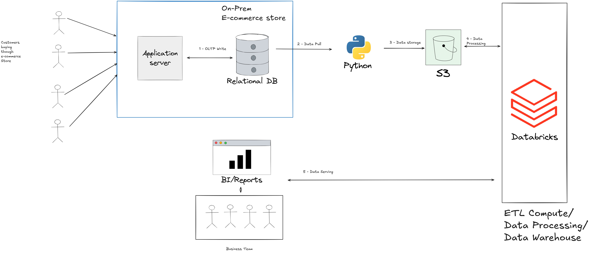

# 🛒 E-Commerce Data Pipeline — Databricks + AWS S3 + Delta Lake


---

## 📌 Project Overview

An end-to-end data engineering pipeline built on **Databricks** using the **Medallion Architecture** (Bronze → Silver → Gold) for an e-commerce domain. Data originates from an **on-premises e-commerce store**, is extracted via **Python**, stored in **AWS S3**, processed in **Databricks** using Delta Lake, and served to **BI/Reports** for business insights.

---

## 🏗️ Architecture



| Step | Component | Description |
|------|-----------|-------------|
| 1 | **On-Prem E-commerce Store** | Customers transact via Application Server → OLTP writes to Relational DB |
| 2 | **Python (Data Pull)** | Python scripts extract data from the Relational DB |
| 3 | **AWS S3** | Raw data stored as landing zone |
| 4 | **Databricks** | ETL Compute + Data Processing + Data Warehouse (Medallion Architecture) |
| 5 | **BI / Reports** | Processed data served to Business Team for reporting |

---

## 🔄 Medallion Architecture

```
AWS S3 (Raw Landing Zone)
        │
        ▼
  ┌─────────────┐
  │   BRONZE    │  ← Raw ingestion from S3 (as-is)
  │  Delta Lake │
  └─────┬───────┘
        │
        ▼
  ┌─────────────┐
  │   SILVER    │  ← Cleaned, deduplicated, type-cast
  │  Delta Lake │
  └─────┬───────┘
        │
        ▼
  ┌─────────────┐
  │    GOLD     │  ← Star Schema (Facts + Dimensions)
  │  Delta Lake │
  └─────────────┘
        │
        ▼
  BI / Reports (Business Team)
```

---

## 🛠️ Tech Stack

| Tool | Purpose |
|------|---------|
| **Databricks** | ETL compute, data processing, data warehouse |
| **AWS S3** | Raw data landing zone and storage |
| **Delta Lake** | ACID-compliant storage across all medallion layers |
| **Python** | Data extraction from on-prem Relational DB |
| **PySpark** | Distributed data transformation |
| **Spark SQL** | SQL-based querying and aggregations |
| **Unity Catalog** | Data governance and catalog management |

---

## 🗂️ Project Structure

```
ecommerce-databricks-pipeline/
├── notebooks/
│   ├── 1_setup/
│   │   └── setup_notebook.ipynb              # Environment setup, S3 config, catalog init
│   ├── 1_medallion_processing_dim/
│   │   ├── 1_dim_bronze.ipynb                # Ingest dimension raw data from S3
│   │   ├── 1_dim_silver.ipynb                # Clean & transform dimension tables
│   │   └── 1_dim_gold.ipynb                  # Build dimension tables (Star Schema)
│   └── 3_medallian_processing_fact/
│       ├── 1_fact_bronze.ipynb               # Ingest fact raw data from S3
│       ├── 2_fact_silver.ipynb               # Clean & transform fact tables
│       └── 3_fact_gold.ipynb                 # Build fact tables (Star Schema)
├── architecture.png
└── README.md
```

---

## 🗄️ Data Model

### Bronze Layer — Raw Tables
| Table | Description |
|-------|-------------|
| `brz_brands` | Raw brand data |
| `brz_calender` | Raw calendar/date data |
| `brz_category` | Raw product category data |
| `brz_customers` | Raw customer data |
| `brz_order_items` | Raw order line items |
| `brz_products` | Raw product data |

### Silver Layer — Cleaned Tables
| Table | Description |
|-------|-------------|
| `slv_brands` | Cleaned brand data |
| `slv_calender` | Cleaned calendar data |
| `slv_category` | Cleaned category data |
| `slv_customers` | Cleaned customer data |
| `slv_order_items` | Cleaned order line items |
| `slv_products` | Cleaned product data |

### Gold Layer — Star Schema
| Table | Type | Description |
|-------|------|-------------|
| `gld_fact_order_items` | Fact | Central fact table with order transactions |
| `fact_transactions_denormalized` | Fact | Denormalized transactions for reporting |
| `gld_dim_customers` | Dimension | Customer dimension |
| `gld_dim_products` | Dimension | Product dimension |
| `gld_dim_date` | Dimension | Date/time dimension |

---

## 🚀 How to Run

1. **Clone this repository**
   ```bash
   git clone https://github.com/PendamShruthii/ecommerce-databricks-pipeline.git
   ```

2. **Import notebooks** into your Databricks workspace

3. **Configure S3 access** using Databricks Secrets (never hardcode credentials)
   ```python
   spark.conf.set("fs.s3a.access.key", dbutils.secrets.get("scope", "aws-access-key"))
   spark.conf.set("fs.s3a.secret.key", dbutils.secrets.get("scope", "aws-secret-key"))
   ```

4. **Run notebooks in order**
   ```
   1_setup → 1_medallion_processing_dim → 3_medallian_processing_fact
   ```

---

## 📊 Key Features

- ✅ Real-world e-commerce architecture (On-Prem → Cloud)
- ✅ Medallion Architecture (Bronze → Silver → Gold)
- ✅ Delta Lake with ACID transactions
- ✅ Star Schema data modelling in Gold layer
- ✅ Unity Catalog for data governance
- ✅ Scalable PySpark transformations
- ✅ BI-ready serving layer for business reporting

---

## 👩‍💻 Author

**Pendam Shruthi**
- 📧 sruthipendam99@gmail.com
- 💼 [LinkedIn](https://linkedin.com/in/shruthi-pendam-a4236b1b0)
- 🐙 [GitHub](https://github.com/PendamShruthii)
